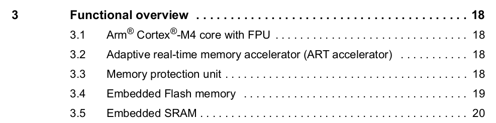

# STM32 Bare Metal Guide

Welcome to a simple and complete generic STM32 Bare Metal Programming Guide !

# Contents

<!-- MarkdownTOC levels="1" autolink="true" style="ordered" markdown_previous="github"-->

1. [Descritpion](#descritpion)
1. [Disclaimer, thanks and references](#disclaimer-thanks-and-references)
1. [Why Programming In Bare Metal ?](#why-programming-in-bare-metal-)
1. [Requirements](#requirements)
	1. [Hardware requirements](#hardware-requirements)
	1. [Software requirements](#software-requirements)
	1. [Files](#files)
		1. [Documentation](#documentation)
		1. [Source code](#source-code)
		1. [Makefile](#makefile)
1. [Organize our work](#organize-our-work)
	1. [Create the project](#create-the-project)
1. [Configuration and programming](#configuration-and-programming)
	1. [Configure your linker script](#configure-your-linker-script)
	1. [A little programming](#a-little-programming)
		1. [Find the built-in LED pin](#find-the-built-in-led-pin)
		1. [Active the GPIO](#active-the-gpio)
		1. [Turn pin to OUTPUT mode](#turn-pin-to-output-mode)
		1. [Set the built-in LED pin](#set-the-built-in-led-pin)
		1. [Adding a delay](#adding-a-delay)
1. [Final step : compile and flash](#final-step--compile-and-flash)
1. [What's next ?](#whats-next-)
1. [Bonus 1 - Understand the makefile](#bonus-1---understand-the-makefile)
1. [Bonus 2 - My rules](#bonus-2---my-rules)

<!-- /MarkdownTOC -->

# Descritpion

STM32 are great electronics devices. Compared to Arduino cards, they can be cheapper and are way more powerful ! However, a STM32 can be harder to program and use the STM32CubeIDE can be really annoying, especially if we like free software and don't like IDE (like me).

Unfortunetaly, programming in bare metal (i.e. without IDE) is not very easy, that's why I decided to create a little guide to make it easier for beginners !

# Disclaimer, thanks and references

This guide is just a way to program your STM32 in bare metal. Not the only one, not the best, just one.

I'm not an expert in STM32 neither in bare metal programming, just a simple enthousiast. Therefore I hope I will not say anything wrong in this guide. I consider myself a beginner who just like to learn some cool stuff and who like to share his work.

Futhermore, nothing could be possible without the help of a good friend of mine. I would like to thank him for introducing me to STM32 cool stuff and bare metal programming ! If this guide helped you in a way or another, you can thank him too !

Finally and of course I didn't make it to scratch. As I said, I had some help from a friend who went through this before me. Moreover, I started my journey and my understanding with a few guides (one my friend advised and one I found) :

- [https://vivonomicon.com/2018/04/02/bare-metal-stm32-programming-part-1-hello-arm/](https://vivonomicon.com/2018/04/02/bare-metal-stm32-programming-part-1-hello-arm/)
- [https://github.com/cpq/bare-metal-programming-guide](https://github.com/cpq/bare-metal-programming-guide)

# Why Programming In Bare Metal ?

What a great question ! First, by programming in Bare Metal you're not stuck with an awful IDE. STM32CubeIDE does the job, but for me it's not very pleasant with the GUI to configure the STM32 in addition to unreadable and heavy code tags. Last, but not least, programming in bare metal is an awesome journey where you can do whatever you want, however you want. Futhermore, it is a great opportunity to better understand how STM32 boards work. So let's get started !

# Requirements

## Hardware requirements 

To follow this guide, all you need is your computer with a Linux distribution and your favorite programming tool and a (Nucleo) STM32.

For this guide, I will use a Nucleo STM32G474RE but feel free to use what you have/like as it is a generic guide which will explain the process step by step for all (or almost all) STM32.

## Software requirements

To begin your STM32 bare metal journey, you will need some software tools :

- [STM32CubeIDE](https://www.st.com/en/development-tools/stm32cubeide.html) (don't worry, it's just for the beginning)
- arm-none-eabi - open your terminal and run the following commands :

```
sudo apt-get remove binutils-arm-none-eabi gcc-arm-none-eabi
sudo add-apt-repository ppa:team-gcc-arm-embedded/ppa
sudo apt-get update
sudo apt-get install gcc-arm-none-eabi
sudo apt-get install gdb-arm-none-eabi
```

- stlink-tools - open your terminal and run the following command :

```
sudo apt-get install stlink-tools
```

## Files

To make it generic and suitable with every STM32, we need to download a few files ([documentation](#documentation), [source code](source-code) and the [makefile](#makefile)).

### Documentation

We can thank ST Microelectronics for making such amazing documentations about their products as we will need it throughout our journey. For each documentation, I will give a link to the one corresponding to the STM32G474RE I will use. All you need to do is clicking the *Download datasheet* button. Here are the documents needed :

- The official datasheet of your STM32 ([STM32G4RE](https://www.st.com/en/microcontrollers-microprocessors/stm32g474re.html))
- The official manual reference of your STM32 serie ([STM32G4 series](https://www.google.com/url?sa=t&rct=j&q=&esrc=s&source=web&cd=&ved=2ahUKEwjW0Yz-3Jf_AhWWUaQEHSG5DWQQFnoECBEQAQ&url=https%3A%2F%2Fwww.st.com%2Fresource%2Fen%2Freference_manual%2Frm0440-stm32g4-series-advanced-armbased-32bit-mcus-stmicroelectronics.pdf&usg=AOvVaw3ftHeU2N_xdW0o3rFDXRUg))
- The official Nucleo user manual for your STM32 ([STM32G4 Nucleo-64 boards](https://www.google.com/url?sa=t&rct=j&q=&esrc=s&source=web&cd=&ved=2ahUKEwjLwpjL65f_AhVKU6QEHVLyCrYQFnoECBAQAQ&url=https%3A%2F%2Fwww.st.com%2Fresource%2Fen%2Fuser_manual%2Fdm00556337-stm32g4-nucleo-64-boards-mb1367-stmicroelectronics.pdf&usg=AOvVaw0BqEGEUKpUagL8S3uQSh38))

The STM32 datasheet will give you all the information about the chip (memory addresses and sizes, interfaces, features...). The official manual reference gives you general information about your STM32 serie of microcontrollers such as the memory mapping (great to write GPIO drivers for instance). Finally, the official Nucleo user manual will help you with your Nucleo board and the pin mapping.

Each time I will refer to a documentation, I will use as an example the documentation from the board I use (STM32G474RE). Of course, apply the examples according to the documentation you use.

### Source code

To begin with bare metal programming you need to recover some files. The best and easiest way is to recover it from STM32CubeIDE. That will be the only time we use STM32CubeIDE. Simply open the IDE, create a new empty project :

File->New->STM32 Project->MCU/MPU Selector, search for the Commercial Part Number (STM32G474RET6 for example), select your nucleo board, type next, choose a name, type finish. Go through the folders to find the following files :

- From Drivers/CMSIS/Include/, recover :
	- cmsis\_armcc.h
	- cmsis\_armclang.h
	- cmsis\_compiler.h
	- cmsis\_gcc.h
	- cmsis\_iccarm.h
	- cmsis\_version.h
	- core\_mX.h (with X the serie of your STM32. As I use one from the STM32G4 serie, in my case it is core_m4.h)
	- mpu\_armv7.h
- From Drivers/CMSIS/Device/ST/STM32XXxx/Include (replace XX by your serie, still G4 in my case) :
	- stm32XXXXxx.h (replace XXX by your STM32, for me it's stm32g474xx.h)
	- stm32XXxx.h (same, replaceX X by the serie, stm32g4xx.h for me)
	- system\_stm32XXxx.h (system\_stm32g474xx.h)

\# What are these files ? And why to we need them ?

These files define everything related to the STM32 from a low level perspective such as registers. Of course you can simply read the documentation and implement everything by yourself. But trust me, you and I don't want to do it. It is very long, boring and useless. Just take a look at the thousands of line of code (I'm not kidding) and you will understand.

In addition to these header files, you need 2 more files. First, the startup file with the '.s' extension :

- Core/Startup/startup\_stm32XXXXXXXX.s (startup_stm32g474retx.s)

This file contains some basic stuff to make the STM32 work such as interruptions.

Then, the linker script (with *.ld* extension) which defines the memory (FLASH and RAM) addresses and length. You can find these 2 linker script files for both the RAM and the FLASH from STM32CubeIDE (*Drivers/STM32XXXXXXXX_FLASH.ld* and *Drivers/STM32XXXXXXXX_FLASH.ld*). However, I advise you to use a unique file you can find [here](./core/startup/stm32g474re.ld). Simply rename this file to match your STM32 (not obligatory but better to stay organized). It is equivalent to the two previous files. We just need to modify a few fields to make it work with each STM32, which is pretty nice !

### Makefile

Finally, I prepared a generic [makefile](#makefile) which will save our lives and make the journey way easier !

\# But hold on. What is a makefile ? And what the hell is a compiler ?

When you program, you write your code in a language we, human (not all, but some) can understand, like C or C++. However, computers doesn't understand these languages and we need to translate the code for them. Guess what, that's exactly what compilers do.

Of course we can use compilers in a terminal and write every command with all the flags, manually. Each time. And of course we don't want to do it. That's why makefile exists. We write everything once and for all in a document named (guess what) makefile (no way !). This way, we can create and use lot easier commands.

Writing a makefile is an art in its own right and it can be hard, especially for beginners. That's why I give you the makefile I use which is generic enough to be used without understanding anything about it. However, learn how to make a makefile is great. That's why I made a bonus complete "guide" to explain how I created the one we will use !

Now that you've got everything you need, let's turn it interesting...

# Organize our work

To make it work in the first hand, we need to create a new project (a simple folder) and store everything in the right place. Indeed I created and respected a few rules to stay organized but feel free to respect it to the letter, change some rules or make your own rules ! However, if you want to create your own rules, be sure to understand how to create a makefile. To better understand the choice behind the project tree and the code you can read my [rules](#bonus-2---my-rules).

## Create the project

Create a folder where you want with the name of your choice. Put inside the makefile, create a 'core' named folder and put somewhere inside the header, startup and linker files (in accordance with my rules if you want to follow them).

To complete the project tree with the bare minimum, add both *main.h* and *main.c* files inside the *core* folder. For this guide, I also added a *gpio.h* and *gpio.c* in the *core* folder. However, you can keep only the *main* files if you prefer and write all the code there.

In the *main.h* file, add the following line :

```
extern "C" void SystemInit() ;
```

And in *main.c* file, add the following line :

```
extern "C" void SystemInit()
{  
}
```

\# Why do we need to do this ? 

In the startup file, a SystemInit function is called and corresponds to the clock initialization function initially defined somewhere in a ST library. However, we don't use this library as the goal of bare metal programming is to implement things all by ourselves (within reasonable limits). However we still need to define this function, even though it doesn't do anything.

In *gpio.c* (or *main.c* if you don't want to use the *gpio* files), add the two following lines :

```
#define STM32G474xx // Define the STM32 used BEFORE INCLUDING THE LIBRARY
#include "stm32g4xx.h" // Include the STM32 library
```

Including the *stm32g4xx.h* file allows the inclusion of all the other needed files with all the necessary defines. The `STM32G474xx` (or equivalent according to the STM32 you use) definition give information to the header files about values that need to be defined.

# Configuration and programming

## Configure your linker script

The first thing we need to do is to tell the linker the lenght of both the FLASH and the RAM memory. Indeed, every STM32 have the same address for both FLASH and RAM but the size may change.

You can find FLASH and RAM length in the STM32 datasheet. In the contents, in the *Functional overview* (section 3) find *Embedded Flash Memory and Embedded SRAM* (sections 3.4 and 3.5) :



Then, go to each section to get the information


As you can see, the STM32G474RE has 512Kbytes of FLASH and 128Kbytes of SRAM.

The next step is to write these information in the linker script. At the beginning of the file, inside the `MEMORY` block, replace the length value of both FLASH and RAM by the correct one :

```
/* end of stack, 128K RAM */
_estack = ORIGIN(RAM) + LENGTH(RAM) ;

MEMORY
{
   FLASH ( rx )      : ORIGIN = 0x08000000, LENGTH = 512K
   RAM ( rxw )       : ORIGIN = 0x20000000, LENGTH = 128K
}
```

The end of stack will then be automatically calculated. That's all. Magic !

## A little programming

Here we (finally) are ! Let's write the code we will put on the board !

To keep things simple, let's write a code whose aim is to make the built-in LED toggle (each Nucleo STM32 board has a built-in LED connected to the D13 Arduino pin). Let's use it thus we don't need additionnal components and we will be able to see what we do which is great to know if it works (or not !).

Everything in an STM32 is essentially a matter of registers. What we are looking for is to toggle a pin on the board, that is to say a GPIO (General Purpose Input Output) and a pin number. Each GPIO is related to some registers with given addresses. With the right values written in the right registers, we can put a pin in the right mode and the right state.

To reach our goal, we need to do a few things :

[1](#find-the-built-in-led-pin). Find the pin the `built-in LED` is attached to

[2](#active-the-gpio). Activate the corresponding `GPIO`

[3](#set-pin-to-output-mode). Set the built-in LED pin to `OUTPUT mode`

[4](#set-the-built-in-led-pin). `Set` the built-in LED pin

[5](#adding-a-delay). Add some `delay`

[6](#set-the-built-in-led-pin). `Reset` the built-in LED pin

[7](#adding-a-delay). Add some `delay`

[8](#making-an-infinite-loop). Encapsulate the four last steps in an `inifite loop`

Are you ready ! Let's do it !

### Find the built-in LED pin

The first thing we need to do is to find the pin the built-in LED is attached to. Open the Nucleo STM32 user manual. Find the mention of the `USER LED` with the corresponding pin :


As you can see above, the LED we are looking for is `LD2 USER` connected to PA5, that is to say GPIOA (port A), pin 5.

### Active the GPIO

In order to activate GPIOA, you need to enable GPIOA using the RCC (Reset and Clock Controller).

Switch to the STM32 reference manual and look for *Memory map and register boundary addresses* (section 2.2.2)


Scroll until you see the *Memory map and peripheral register boundary addresses* table and look for the *GPIOA* line.


As you can see above *GPIOA* is related to AHB2 bus.

Write the enable value in the AHB2 register of the RCC **without touching others registers value** applying a *OR* mask. You can find this value searching for a define which contains RCC, the bus, the right GPIO and *EN* (enable).

```
RCC->AHB2ENR |= RCC_AHB2ENR_GPIOAEN ;
```

### Set pin to OUTPUT mode

Again, it is a story of register ! The register for *GPIO Mode* is named `MODER`.
We need to reset the value of the pin 5 of the *GPIOA* and write the value of the `OUTPUT mode` without changing any other values in order not to impact other pins state (using a `NOT AND` operation followed with a `OR` operation). We can find this value in the reference manual. Go to the *General-purpose I/Os (GPIO)* section, *GPIO registers* section, *GPIO port mode register (GPIOx_MODER)* (9.4.1) :


From this section we can learn that the `General purpose output mode` value is 01.

Now go back to the code. From the 'stm32g474xx.h' file, search for `MODER` defines. As we're looking for pin 5, we're interested in `GPIO_MODER_MODE5`.
Let's first apply the mask to disable the previous mode of the pin and then set the output value (01) for pin 5 (shifting this value to the corresponding position given by `GPIO_MODER_MODE5_Pos`) :

```
GPIOA->MODER &= ~GPIO_MODER_MODE5_Msk ;
GPIOA->MODER |= 0x1 << GPIO_MODER_MODE5_Pos ;
```

### Set the built-in LED pin

One simple way to change the output state of a pin is to use the ODR register. It's not the best way but it is good enough for us.

In 'stm32g474xx.h', search for `ODR` defines and scroll to `GPIO_ODR_OD5`. Apply a `OR` operation to the ODR register of the GPIOA :

```
GPIOA->ODR |= GPIO_ODR_OD5 ;
```

To reset the pin, we do the opposing operation (`AND NOT` operation) :

```
GPIOA->ODR &= ~GPIO_ODR_OD5 ;
```

### Adding a delay

To add some delay between set and reset operations and have the blinky effect, we write the `spin` function :

```
static inline void spin(volatile uint32_t count)
{
  while (count--) asm("nop");
}
```

This function simply run the `nop` assembler operation which does... nothing. But nothing for a clock cycle. Thus repeating the operation for a given number of clock cycle gives you a delay. That's it !

### Making an infinite loop

We finally merge everything together with an infinity loop (a while or for loop does the job) to get the following code gpioToggleLed function :

```
void gpioToggleLed()
{
	RCC->AHB2ENR |= RCC_AHB2ENR_GPIOAEN ;
	GPIOA->MODER &= ~GPIO_MODER_MODE5_Msk ;
	GPIOA->MODER |= 0x1 << GPIO_MODER_MODE5_Pos ;

	for (;;)
	{
		GPIOA->ODR |= GPIO_ODR_OD5 ;
		spin(999999);
		GPIOA->ODR &= ~GPIO_ODR_OD5 ;
		spin(999999);
  }
}
```

Add this function to the *main* or *gpio* files and we're done ! Now you should have something similar to the current repository.

# Final step : compile and flash

Open your project folder containing the makefile in a terminal. 

To compile the code, run `make`. A *build* folder will be created with all the objects and target files built. However you don't need to care about it.

To flash the code, connect your STM32 to your computer and run `make flash`. 
Congratulation ! The LED is blinking !

To clean the folder (i.e. remove every built file), run `make clean`

You can use the debugger running `make debug`

I hope this guide helped you to begin with STM32 bare metal programming and that you're now ready for future adventures !

# What's next ?

Now that you have the basic setup to program a STM32 in bare metal feel free to dive into the STM32 documentations and program the different libraries you need to implement the different interfaces and features I've discussed (GPIO, UART, interruptions, SPI, I2C...).

\# OK, that's great, but it is C bare metal programming. What if I would like to take advantage of the C++ object-oriented notions and use C++ instead of C ? What if I would like to use C++ libraries (like arduino ones), make them work with STM32 alongside my C projects ? Or the reverse case ?

Here comes the best part of the makefile I've written. It make it all work together, no matter the configuration ! Don't trust me ? Simply try different configurations with the basic setup alternating between '.c' and '.cpp' extensions for source files and '.h' and '.hpp' header files for header files.

Again, the aim of this guide is to make the easiest and the most generic setup for STM32 bare metal programming. Now it's time to wish you the best for the future of you journey !

# Bonus 1 - Understand the makefile

Here we are... Don't worry, take a breathe, everything is fine ! Let's break the ice.

First, we define the directories we use. The first 3 directories contain the code. The last one the built code. That makes sense.

```
# Define directories
CORE_DIR = ./core
DRIVERS_DIR = ./drivers
LIB_DIR = ./lib
BUILD_DIR = ./build
```

Then we define the target location which is directly in the build directory :

```
# Define target location
TARGET = $(BUILD_DIR)/test
```

We also need to find both the linker script and the startup files. To do it, we simply use the shell `find` command which does the job for us. We simply tell `find` the name (`-name` option) of the files we're looking for (everything containing '.ld' and '.s').

```
# Define the linker script location
LD_SCRIPT = $(shell find $(CORE_DIR) -name *.ld)

# Define the startup file location
STARTUP = $(shell find $(CORE_DIR) -name *.s)
```

Next, the chip architecture :

```
# Define the chip architecture
MCU_SPEC = cortex-m4
FPU_SPEC = fpv4-sp-d16
```

For the `MCU_SPEC`, you can find this information at the beginning of the STM32 datasheet :


As the compiler need to know where to find all the include files, we need to find them. I mean. We need the shell `find` command to find them. As they can be in *core*, *drivers* and *lib* directories, we add them all. For the rest of the command I surrender, I asked ChatGPT (shame on me). I guess it searches all directories containing files with '.h' or '.hpp' extensions and remove the duplicates.

```
# Define include directories
INC_DIRS = $(shell find $(CORE_DIR) $(DRIVERS_DIR) $(LIB_DIR) -type d -exec sh -c 'ls -1 "{}"/*.h > /dev/null 2>&1' \; -print)
INC_DIRS += $(shell find $(CORE_DIR) $(DRIVERS_DIR) $(LIB_DIR) -type d -exec sh -c 'ls -1 "{}"/*.hpp > /dev/null 2>&1' \; -print)
```

We then add the `-I` option before each include directory to make the include flags for `g++` (the compiler used to compile *c* and *cpp* files) :

```
# Define include flags
INC_DIRS_FLAG = $(addprefix -I, $(INC_DIRS))
```

Next, we get every source file location :

```
# Define source files location
C_SRCS = $(shell find $(CORE_DIR) $(DRIVERS_DIR) $(LIB_DIR) -name '*.c')
CPP_SRCS = $(shell find $(CORE_DIR) $(DRIVERS_DIR) $(LIB_DIR) -name '*.cpp')
```

Here are all the tools/compilers we need (and some we don't I admit), all located in the '/usr' directory in the system :

```
# Toolchain definitions (ARM bare metal defaults)
TOOLCHAIN = /usr
CPP = $(TOOLCHAIN)/bin/arm-none-eabi-g++
AS  = $(TOOLCHAIN)/bin/arm-none-eabi-gcc
LD  = $(TOOLCHAIN)/bin/arm-none-eabi-ld
OC  = $(TOOLCHAIN)/bin/arm-none-eabi-objcopy
OD  = $(TOOLCHAIN)/bin/arm-none-eabi-objdump
OS  = $(TOOLCHAIN)/bin/arm-none-eabi-size
```

Now it's time to build all the flags the compilers need. You can do like I did and don't think about it, just add them all. A little disclaimer for the commented `-nostdlib` option : uncomment this line only if needed. By default, `g++` compile the target with the standard library, and it's fine. 

```
# Assembly directives.
ASFLAGS += -c
ASFLAGS += -Og
ASFLAGS += -mcpu=$(MCU_SPEC)
ASFLAGS += -mthumb
ASFLAGS += -Wall
ASFLAGS += -fmessage-length=0

# C and C++ compilation directives
CPPFLAGS += -mcpu=$(MCU_SPEC)
CPPFLAGS += -mthumb
CPPFLAGS += -march=armv7e-m
CPPFLAGS += -mfloat-abi=hard
CPPFLAGS += -mfpu=$(FPU_SPEC)
CPPFLAGS += -Wall
CPPFLAGS += -g3
CPPFLAGS += -Og
#CPPFLAGS += -fno-inline
CPPFLAGS += -fmessage-length=0 -fno-common
CPPFLAGS += -ffunction-sections -fdata-sections
CPPFLAGS += -fno-exceptions
CPPFLAGS += -fno-rtti
CPPFLAGS += -std=c++11

# Linker directives.
LSCRIPT = $(LD_SCRIPT)
LFLAGS += -mcpu=$(MCU_SPEC)
LFLAGS += -mthumb
LFLAGS += -mfloat-abi=hard
LFLAGS += -mfpu=$(FPU_SPEC)
LFLAGS += -Wall
LFLAGS += -march=armv7e-m
LFLAGS += --static
LFLAGS += --specs=nosys.specs
#LFLAGS += -nostdlib # Uncomment in order NOT to include the standard library
LFLAGS += -Wl,-Map=$(TARGET).map
LFLAGS += -lgcc
LFLAGS += -Wl,--gc-sections
LFLAGS += -Wl,--print-memory-usage
LFLAGS += -Wl,-L./ld
LFLAGS += -lc
LFLAGS += -nostartfiles
LFLAGS += -T$(LSCRIPT)
```

Then, we define every objects. To do this, we make sure the sources are defined (checking if the variables are not empty). Each object file is stored in the 'build' directory and the path is preserved. 

```
# If there is at least one startup file, define the correponding object(s) location
ifneq ($(STARTUP),)
	OBJS += $(addprefix $(BUILD_DIR)/, $(STARTUP:.s=.o))
endif

# If there is at least one C file, define the correponding object(s) location
ifneq ($(C_SRCS),)
	OBJS += $(addprefix $(BUILD_DIR)/, $(C_SRCS:.c=.o))
endif

# If there is at least one C++ file, define the correponding object(s) location
ifneq ($(CPP_SRCS),)
	OBJS += $(addprefix $(BUILD_DIR)/, $(CPP_SRCS:.cpp=.o))
endif
```

We define the *rm* command according to the OS we use. I'm not sure it's useful as we know we use Linux.

```
# Define the rm command according to the OS
ifeq ($(OS),Windows_NT)
  RM = cmd /C del /Q /F
else
  RM = rm -f
endif
```

And finally here are every commands we can run.

```
# Entry point of the makefile
.PHONY: all
all: $(TARGET).bin 

$(BUILD_DIR)/%.o: %.s
	@mkdir -p $(dir $@)
	$(AS) -x assembler-with-cpp $(ASFLAGS) $< -o $@

$(BUILD_DIR)/%.o: %.c
	mkdir -p $(dir $@)
	$(CPP) -c $(CPPFLAGS) $(INC_DIRS_FLAG) $< -o $@

$(BUILD_DIR)/%.o: %.cpp
	mkdir -p $(dir $@)
	$(CPP) -c $(CPPFLAGS) $(INC_DIRS_FLAG) $< -o $@

$(TARGET).elf: $(OBJS)
	@mkdir -p $(dir $@)
	$(CPP) $^ $(LFLAGS) -o $@

$(TARGET).bin: $(TARGET).elf
	@mkdir -p $(dir $@)
	$(OC) -S -O binary $< $@

# Clean the project and rebuild it
.PHONY: fromscratch
fromscratch: clean $(TARGET).bin

# Clean the project
.PHONY: clean
clean:
	rm -rf $(BUILD_DIR)/*

# Enter debug mode using gdb
.PHONY: debug
debug:
	st-util&
	arm-none-eabi-gdb -ex="target extended-remote : 4242" $(TARGET).elf
	pidof ../tools/st-util | xargs kill

# Flash the code into the board
.PHONY: flash
flash:
	st-flash --reset write $(TARGET).bin 0x08000000

```

First thing we need to know is that `make` is equivalent to `make all`, that is to say make all the stuff we need. So here what happens when we run `make`. :

- all needs target.bin
- target.bin needs target.elf
- target.elf needs all the objects to be built
- The path to the object file (in the build directory) is made and each object (from C source file, C++ source file or startup file) is built with the corresponding compiler and flags.
- Once all objects are built, target.elf can be built.
- Once target.elf is built, target.bin can be built

There are a few other commands we can run :

- `make fromscratch` clean the project and rebuild everything. It is useful when we bring some changes to a header file used by a source file for instance.
- `make clean` clean the project (duh !) i.e. delete the build directory (that's better).
- `make debug` allows us to use `gdb` which is a debugger, an amazing tool to know exactly what is done, step by step, inside the STM32. I advise you to do some research about such tools, it can save you life !
- `make flash` flash the code inside the STM32.
 
# Bonus 2 - My rules

As I said, I created my own set of rules for the project tree derived from STM32CubeIDE. I'm sure there are better rules and organization, but that how I work (for the moment) ! I divided my projects in a few parts, every part being a folder :

- core : contains every core features related to the STM32 (GPIO, UART, timers, interrupts, SPI, I2C...)
	- inc : contains the header files (includes, i.e. .h and/or .hpp) of the core features
	- src : contains the source files (.c and/or .cpp) of the core features
	- startup : contains the startup file and linker script of the STM32
	- cmsis : contains every headers of the CMSIS and Device header files.
- drivers : contains every software module to drive other electronic components (from a low level perspective)
- lib : contains every other software components (from a high level perspective)

To better understand how I manage my projects, here some other generic rules I use:

- every module/folder (except inc, src and startup) can contain a submodule/subfolder being a library (ex : core/gpio for gpio features, or one library for each components in the drivers folder)
- every '.h' and '.hpp' files are stored in a 'inc' folder
- every '.c' and '.cpp' files are stored in a 'src' folder
- every folder and file names are in lowercase as it's easier to travel through in a terminal
- To avoid multiple header inclusions, I use the following syntax :
	- in headername.h :

```
#ifndef __HEADERNAME_H__
#define __HEADERNAME_H__

...

#endif

```

It make it clearer for me and seperated these define from other defines.

[========== Go to top ==========](#stm32-bare-metal-guide)